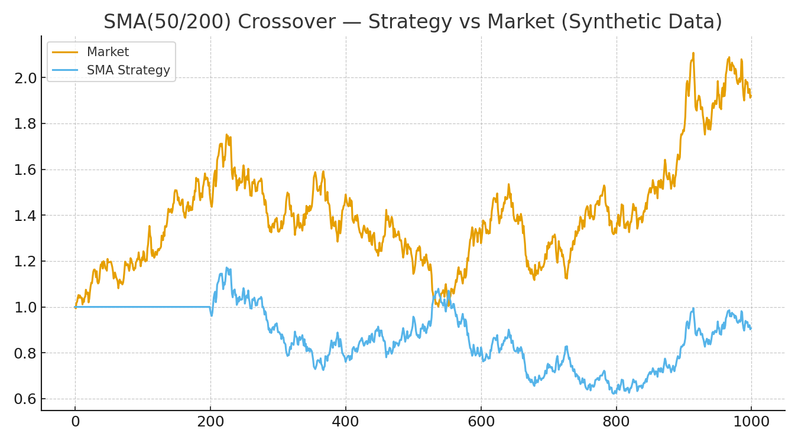
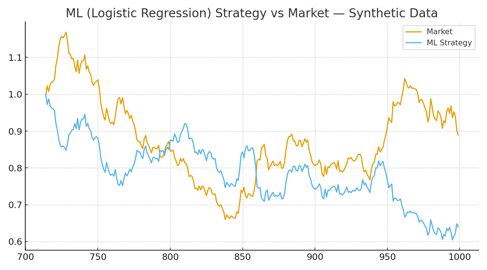
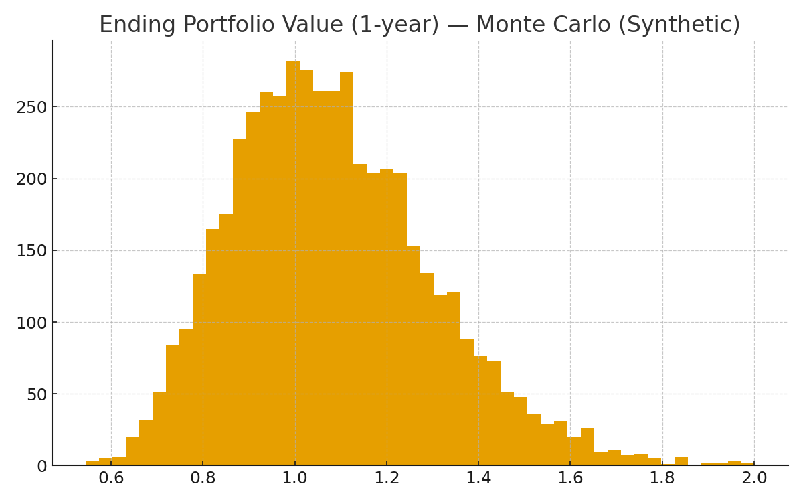

# Quant Finance Strategies — Python

A compact, recruiter-friendly set of quant projects showing practical Python for data handling, feature engineering, backtesting, and basic risk simulation. Uses synthetic data so it runs anywhere.

## Structure
quant-finance-strategies/
├── README.md
├── requirements.txt
├── moving_average.py
├── algorithmic_trading.py
├── monte_carlo.py
├── sma_vs_market.png
├── strategy_vs_market_ml.png
└── ending_value_distribution.png

## Quick start
```bash
pip install -r requirements.txt

python moving_average.py
python algorithmic_trading.py
python monte_carlo.py \`\`\`

## Sample Outputs

**SMA(50/200) Strategy vs Market**  


**Logistic Regression Trading Strategy**  


**Monte Carlo Ending Portfolio Distribution**  

