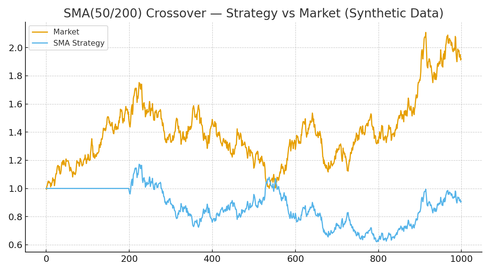
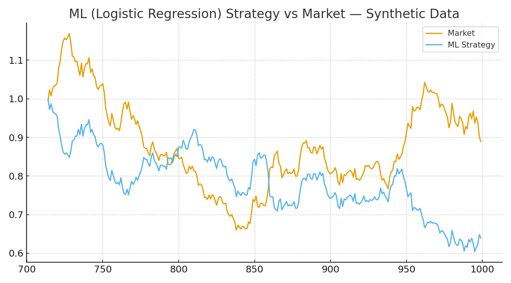
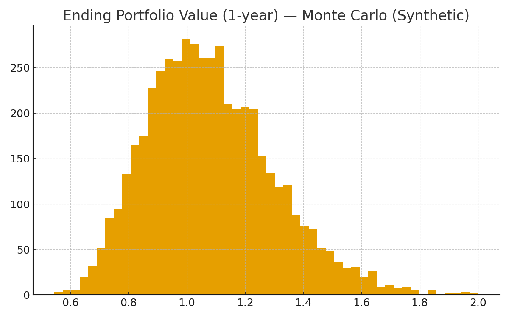

# Quant Finance Strategies — Python

A compact, recruiter-friendly set of quant projects showing practical Python for data handling, feature engineering, backtesting, and basic risk simulation. Uses synthetic data so it runs anywhere.

## Structure
quant-finance-strategies/  
├── README.md  
├── requirements.txt  
├── moving_average.py  
├── algorithmic_trading.py  
├── monte_carlo.py  
├── images/  
│   ├── sma_vs_market.png  
│   ├── strategy_vs_market_ml.png  
│   └── ending_value_distribution.png  

## Quick start
```bash
pip install -r requirements.txt

python moving_average.py
python algorithmic_trading.py
python monte_carlo.py
```

## Sample Outputs

**SMA(50/200) Strategy vs Market**  
A simple moving average crossover system — buy when the 50-day SMA crosses above the 200-day SMA, sell when it crosses below.  


**Logistic Regression Trading Strategy**  
A machine learning approach using logistic regression to predict next-day returns and decide when to be in or out of the market.  


**Monte Carlo Ending Portfolio Distribution**  
A risk simulation showing possible ending portfolio values after 1 year, based on thousands of random return paths.  


---

## Why this project?
This repository demonstrates:
- **Backtesting**: SMA strategy logic tested against synthetic data.  
- **Machine Learning in Finance**: Logistic regression for trading signals.  
- **Risk Analysis**: Monte Carlo simulations for portfolio value distribution.  

Together, they show practical applications of Python in quant finance — blending **statistics, machine learning, and risk management** in a lightweight, easy-to-run format.
